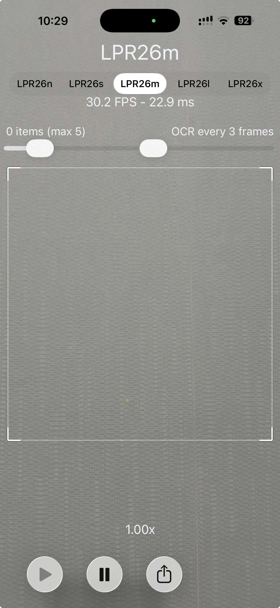
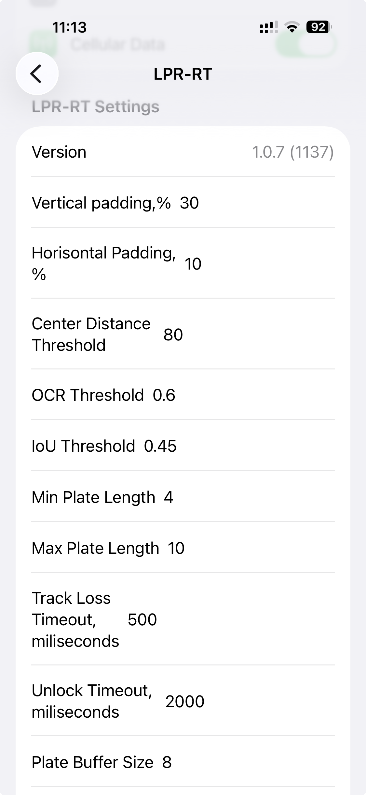

# License Plate Reader (LPR)

A simple and fast iPhone application for recognizing vehicle license plates using the device camera.

All recognition and image processing are performed entirely on the device. No images or recognized license plate data are uploaded, stored, or shared.

## Features

- 🚗 Fast license plate recognition
- 📷 Real-time recognition using the iPhone camera
- 🔒 Fully on-device OCR
- 🌐 No network transmission of camera images
- 🧹 Minimal and clean user interface
- 🔢 Supports alphanumeric license plates in various formats
- ⚡ Designed for fast recognition and simple everyday use

## Privacy & Security

Privacy is a core principle of License Plate Reader.

The application:

- Does not collect personal information
- Does not store recognized license plates
- Does not upload camera images
- Does not share recognition results with third parties
- Does not use analytics
- Does not display advertisements
- Does not use tracking
- Does not require an account or registration

All image processing and OCR are performed locally on the user's iPhone.

## How It Works

1. Point the iPhone camera at a vehicle license plate.
2. The application captures and processes the image locally.
3. The license plate is detected and recognized using on-device OCR.
4. The recognized result is displayed to the user.
5. The processed image and recognition data are not stored after processing.

## Use Cases

License Plate Reader is intended for personal and small-scale utility purposes, such as:

- Managing your own vehicle plates
- Recording vehicle plates in small private parking areas
- Personal vehicle-related utilities
- Simple automation tasks
- Testing and experimenting with on-device computer vision and OCR

## Technology

The project is built for Apple platforms using:

- **Swift**
- **Xcode**
- **iOS**
- **AVFoundation** for camera access
- **Core Image / Vision** for image processing and recognition tasks
- **CocoaPods** for dependency management
- **On-device OCR** for license plate recognition

## Requirements

- macOS
- Xcode
- iPhone running a supported version of iOS
- CocoaPods

## Installation

Clone the repository:

```bash
git clone git@github.com:abaibuz/LPR.git
cd LPR
```

Install the CocoaPods dependencies:
```bash
pod install
```

Open the workspace:
```bash
open YOLO.xcworkspace
```

Then select your iPhone as the target device and build the application from Xcode.
Do not open YOLO.xcodeproj when using CocoaPods. Use YOLO.xcworkspace.

## Project Structure

```text
LPR/
├── Screenshots/
│   ├── main-screen.png
│   ├── recognition.png
│   └── result.png
├── YOLO/
├── YOLO.xcodeproj
├── Podfile
├── Podfile.lock
├── .gitignore
└── README.md
```

The Pods/ directory is generated locally by CocoaPods and is intentionally excluded from Git.

## Screenshots

<p align="center">
  
  
  
</p>

## Privacy

License Plate Reader is designed as a personal utility tool, not as a surveillance system.
The application does not store recognized license plates or collect personal information. Camera images are processed locally on the device and are not transmitted to external servers.
Users are responsible for complying with applicable laws and regulations when using the application to recognize or record license plates.

## License

This project is currently provided for personal and educational purposes.
See the repository for the current license status.

## Author

OBaibuz
GitHub: https://github.com/abaibuz
